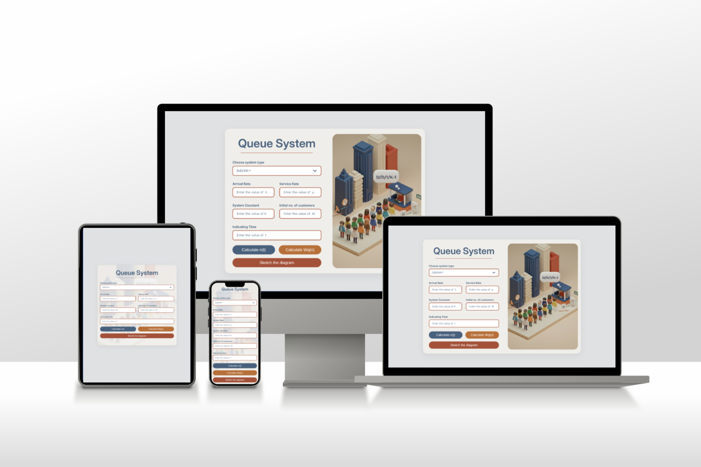
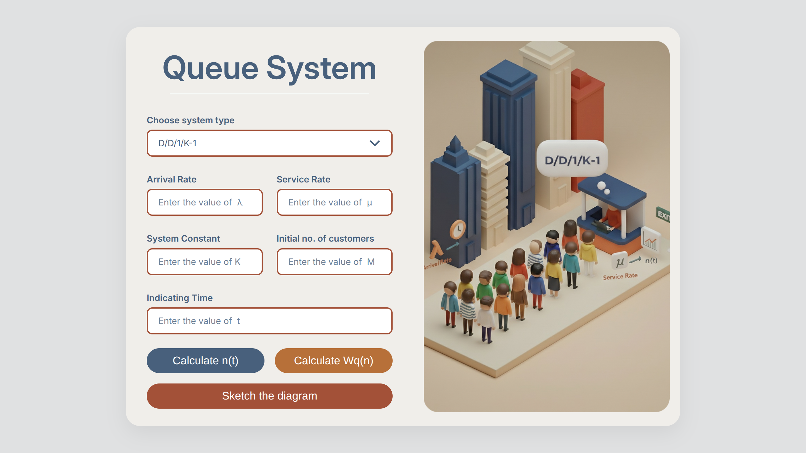
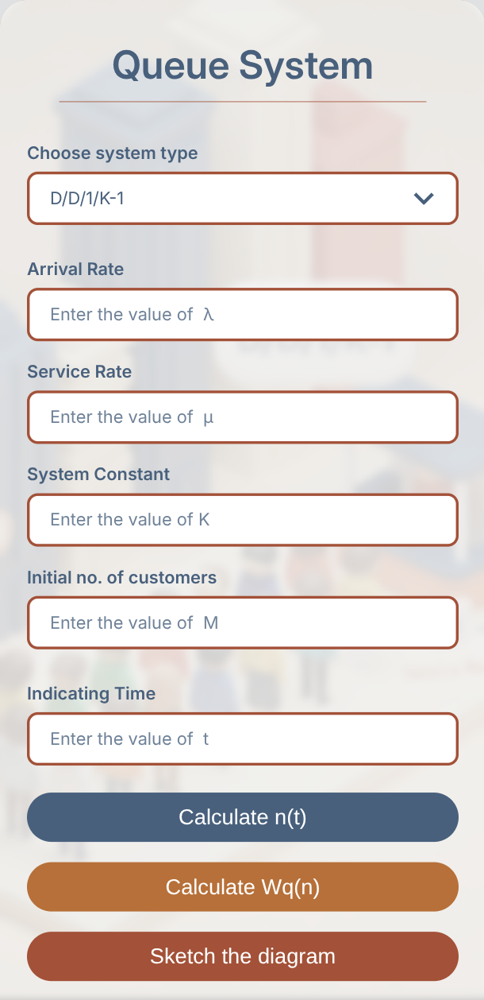

# 📊 Queue System Application

<div align="center">
  
  <br><br>

<a href="https://omar-eng-sys.github.io/QueueSystemApplication/">
    
  </a>

<p>
    <i>A powerful, interactive, and responsive web-based simulator for visualizing and calculating Queueing Theory models. Featuring a robust implementation of the complex <b>D/D/1/K-1 Saturation Case</b>.</i>
  </p>
</div>

---

## 🚀 Overview

Queueing theory formulas are great, but they often break down in edge cases—specifically when arrival rates exceed service rates (Saturation). This project is not just a calculator; it's a discrete-event simulator.

I built this tool to handle the mathematical intricacies of **M/M/1**, **M/M/C**, and the notorious **D/D/1/K-1**, wrapping complex logic in a modern, user-friendly interface.

## ✨ Key Features

-   **⚡ Dynamic System Handling:** Supports multiple models:
    -   **M/M/1:** Infinite Capacity, Single Server.
    -   **M/M/C:** Infinite Capacity, Multi-Server.
    -   **D/D/1/K-1:** Deterministic, Finite Capacity (The star of the show!).
-   **🧠 The "Saturation" Fix:** Implements a custom simulation algorithm to handle `λ > μ` cases in D/D/1, solving issues where standard direct formulas fail due to periodicity and floating-point errors.
-   **📱 Fully Responsive:** Optimized for Desktop, Tablet, and Mobile. Complex tables and charts adapt seamlessly to smaller screens.
-   **🎨 Modern UI:** Clean aesthetic with 3D illustrations and real-time form validation.
-   **📈 Visual Sketches:** Generates visual diagrams for the queue status over time.

## 🛠️ The Challenge: D/D/1/K-1 Saturation

The biggest technical hurdle in this project was the **Deterministic Saturation Case** (`Arrival Rate > Service Rate`). Standard mathematical models often fail to pinpoint the exact "Critical Time Intervals" ($t_i$) due to cycle shifts.

**Our Solution:**
Instead of relying on brittle direct formulas, I implemented a **Time-Step Simulation Logic**:

1. **Precise Ti Calculation:** The algorithm steps through time to find the exact moment the system hits capacity ($K$).
2. **Cycle Detection:** It calculates the LCM (Least Common Multiple) of arrival and service times to determine the system's periodic cycle.
3. **Pattern Recognition:** It maps the queue state ($n(t)$) to these cycles, ensuring 100% accuracy indefinitely.

## 💻 Tech Stack

-   **Core:** HTML5, CSS3, Vanilla JavaScript (ES6+).
-   **Visualization:** Chart.js (for diagrams).
-   **UI/Alerts:** SweetAlert2.
-   **Design:** CSS Grid & Flexbox for responsive layout.

## 📸 Screenshots

|          Desktop View           |          Mobile View           |
| :-----------------------------: | :----------------------------: |
|  |  |

## 🚀 How to Run

You can try the simulator directly in your browser without installation:

### [🔴 Click Here for Live Demo](https://omar-eng-sys.github.io/QueueSystemApplication/)

Or run it locally:

1. Clone the repository:
    ```bash
    git clone [https://github.com/Omar-eng-sys/QueueSystemApplication.git](https://github.com/Omar-eng-sys/QueueSystemApplication.git)
    ```
2. Open `index.html` in your browser.
3. Choose a system type and start simulating!

## 🔮 Future Improvements

-   [ ] Add support for M/G/1 systems.
-   [ ] Export calculation results as PDF.

## 🤝 Credits

-   **Development & UI:** [Eng. Omar Nasser](https://www.linkedin.com/in/omar-nasser-74226630b/)
-   **Core Logic Support:** Special thanks to the team for collaborating on the Java-based logic for the D/D/1/k-1 saturation cycle algorithm.

---

_Made with ❤️ by a Systems Engineer who loves pixel-perfect UIs._
